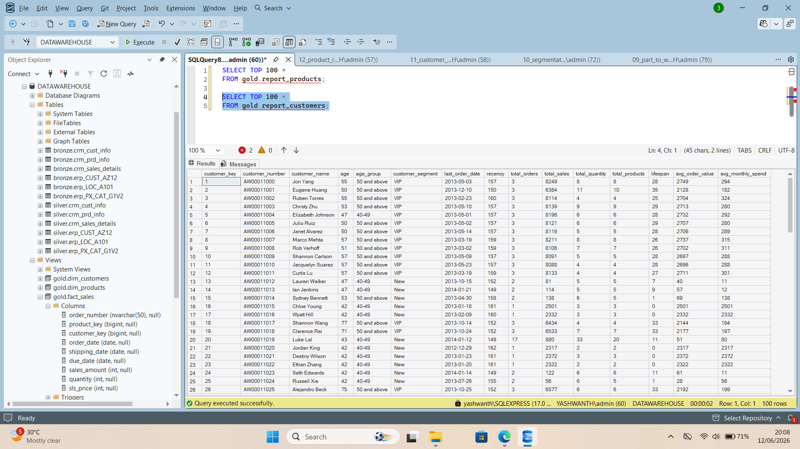
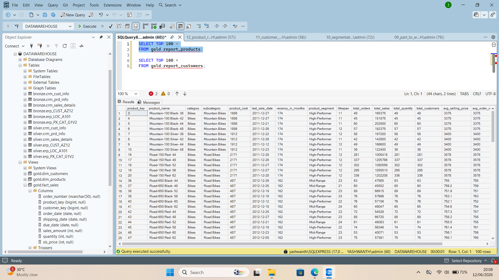
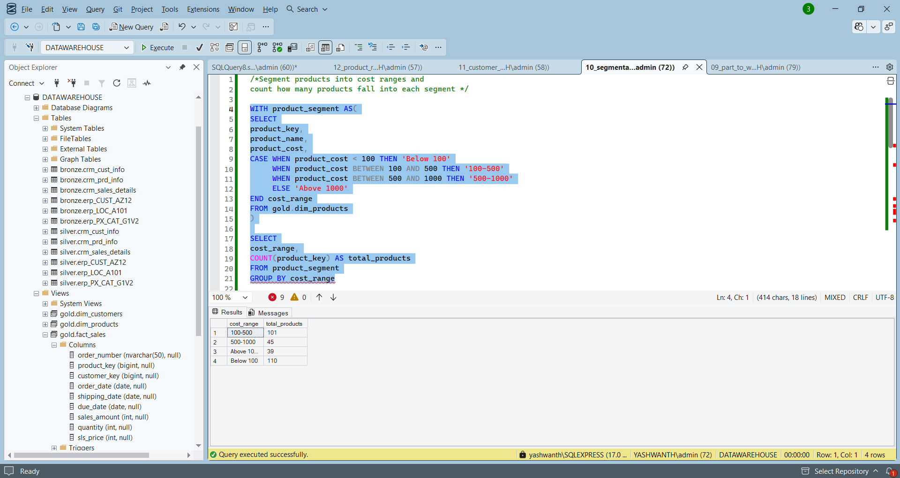
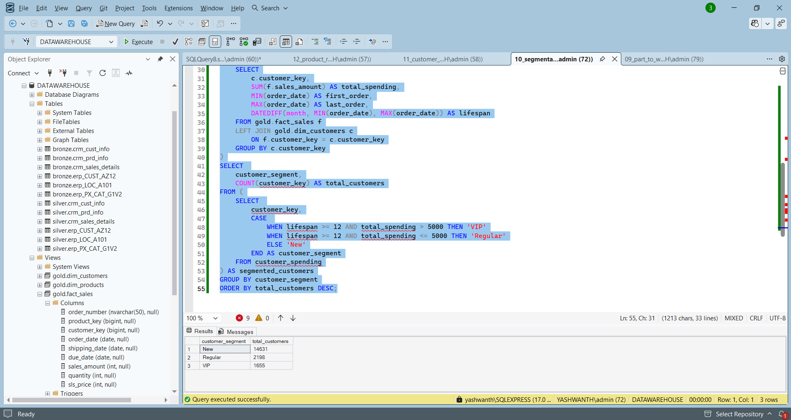
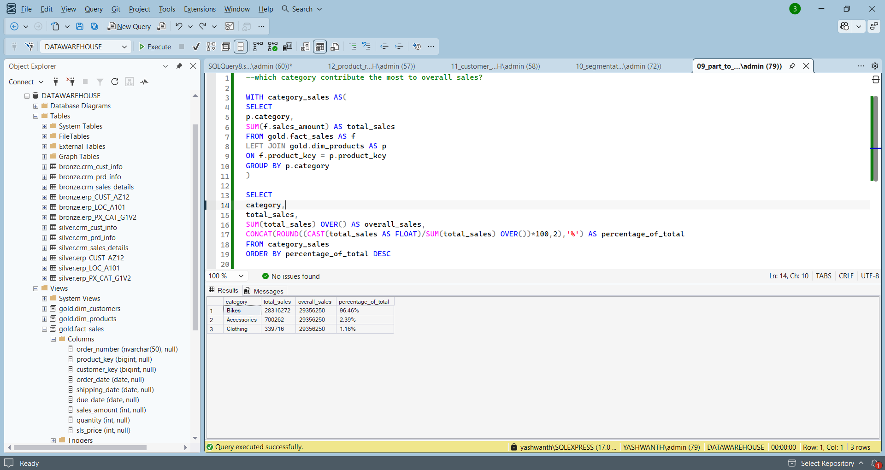
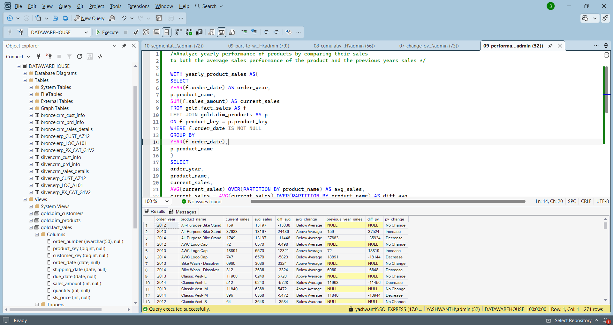
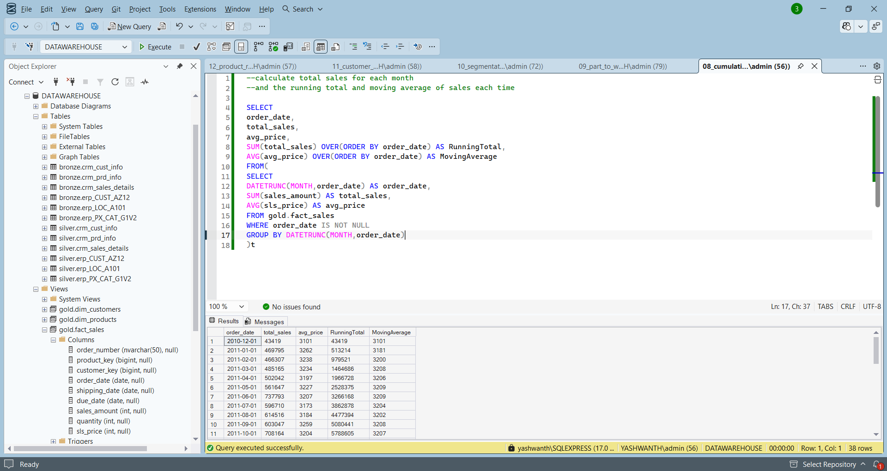
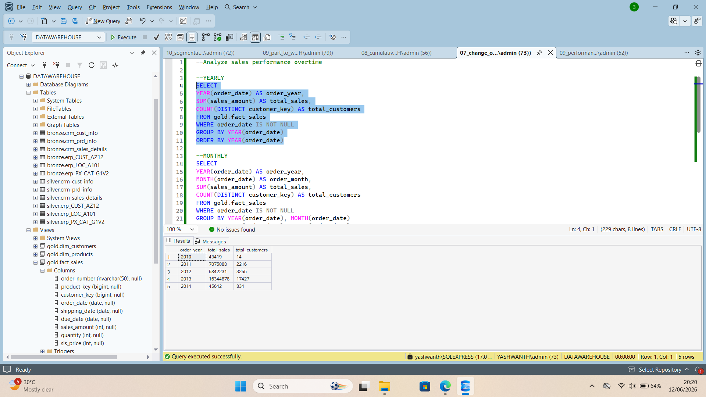

# Advanced Data Analytics Project

## Project Overview

This project demonstrates advanced SQL analytics techniques built on top of a SQL Server Data Warehouse.

The project focuses on transforming raw business data into actionable insights using:

* Exploratory Data Analysis (EDA)
* Customer Analytics
* Product Analytics
* Segmentation Analysis
* Time-Series Analysis
* Performance Analysis
* Window Functions
* KPI Reporting

The analysis is performed using SQL Server and leverages fact and dimension tables from a modern Data Warehouse architecture.

---

## Project Objectives

The main objectives of this project are:

* Explore and understand business data
* Analyze customer behavior and purchasing patterns
* Evaluate product performance
* Build customer and product segmentation models
* Analyze sales trends over time
* Generate business KPIs
* Apply advanced SQL techniques and window functions
* Create reusable analytical SQL reports

---

## Technologies Used

* SQL Server
* SQL Server Management Studio (SSMS)
* T-SQL
* Window Functions
* Common Table Expressions (CTEs)
* Aggregate Functions
* Ranking Functions
* Views
* Business Analytics
* Data Warehousing

---

## Analysis Performed

### 1. Database Exploration

* Explore database objects
* Understand tables and columns
* Identify business entities

### 2. Dimensions Exploration

* Customer dimension analysis
* Product dimension analysis

### 3. Measures Exploration

* Sales analysis
* Quantity analysis
* Business metrics exploration

### 4. Magnitude Analysis

* Product category performance
* Sales contribution analysis

### 5. Ranking Analysis

* Top-performing products
* Top customers
* Business leaderboards

### 6. Change Over Time Analysis

* Monthly sales trends
* Yearly sales trends
* Customer growth analysis

### 7. Cumulative Analysis

* Running totals
* Moving averages
* Trend monitoring

### 8. Performance Analysis

Compare yearly product performance against:

* Average product sales
* Previous year sales
* Growth and decline trends

### 9. Part-to-Whole Analysis

* Category contribution percentage
* Overall sales contribution
* Revenue distribution analysis

### 10. Segmentation Analysis

#### Product Segmentation

Products grouped into cost ranges:

* Below 100
* 100–500
* 500–1000
* Above 1000

#### Customer Segmentation

Customers categorized as:

* VIP
* Regular
* New

---

## Customer Report

The customer report consolidates customer-level KPIs and behavioral metrics.

### Included Metrics

* Customer Name
* Customer Age
* Age Group
* Customer Segment
* Total Orders
* Total Sales
* Total Quantity Purchased
* Total Products Purchased
* Customer Lifespan
* Recency
* Average Order Value
* Average Monthly Spend

---

## Product Report

The product report consolidates product-level KPIs and performance metrics.

### Included Metrics

* Product Name
* Category
* Subcategory
* Product Cost
* Product Segment
* Total Orders
* Total Sales
* Total Quantity Sold
* Total Customers
* Product Lifespan
* Recency
* Average Selling Price
* Average Order Revenue
* Average Monthly Revenue

---

## Project Structure

```text
ADVANCED-DATA-ANALYTICS-PROJECT
│
├── scripts
│   ├── 01_database_exploration.sql
│   ├── 02_dimensions_exploration.sql
│   ├── 03_date_exploration.sql
│   ├── 04_measures_exploration.sql
│   ├── 05_magnitude_exploration.sql
│   ├── 06_ranking_exploration.sql
│   ├── 07_change_over_time_analysis.sql
│   ├── 08_cumulative_analysis.sql
│   ├── 09_part_to_whole_analysis.sql
│   ├── 09_performance_analysis.sql
│   ├── 10_segmentation_analysis.sql
│   ├── 11_customer_report_analysis.sql
│   └── 12_product_report_analysis.sql
│
├── screenshots
│   ├── 01_customer_report.png
│   ├── 02_product_report.png
│   ├── 03_product_segmentation.png
│   ├── 04_customer_segmentation.png
│   ├── 05_part_to_whole_analysis.png
│   ├── 06_performance_analysis.png
│   ├── 07_cumulative_analysis.png
│   └── 08_change_over_time_analysis.png
│
└── README.md
```

---

## Key SQL Concepts Used

* Common Table Expressions (CTEs)
* CASE Statements
* Aggregate Functions
* Window Functions
* OVER()
* PARTITION BY
* LAG()
* Running Totals
* Moving Averages
* Ranking Functions
* Analytical Reporting Views
* Business KPI Calculations

---

## Sample Outputs

### Customer Report



### Product Report



### Product Segmentation



### Customer Segmentation



### Part-to-Whole Analysis



### Performance Analysis



### Cumulative Analysis



### Change Over Time Analysis



---

## Business Insights Generated

* Identified high-value customers using segmentation techniques.
* Evaluated customer purchasing behavior and lifecycle metrics.
* Measured product performance across multiple years.
* Analyzed category contribution to overall revenue.
* Generated KPI-driven customer and product reports.
* Applied advanced SQL analytical functions for business reporting.
* Created reusable SQL views for reporting and dashboard development.

---

## Author

### Yashwanth Samineni

Aspiring Data Analyst skilled in:

* SQL
* Power BI
* Python
* Excel
* Data Warehousing
* Business Analytics

GitHub Profile:
https://github.com/Yashwanth880-hub
